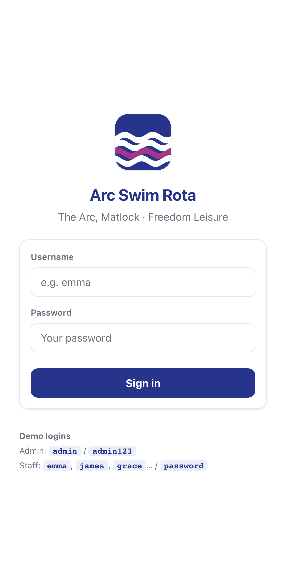
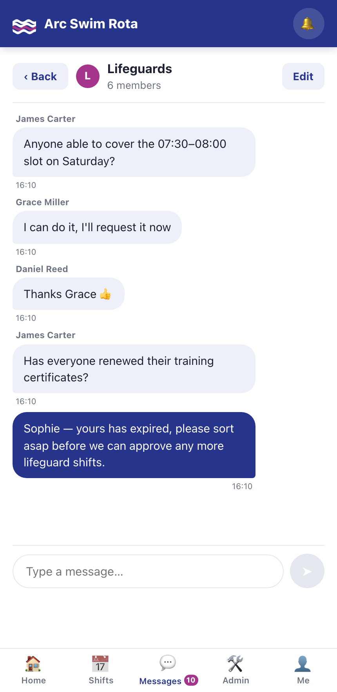
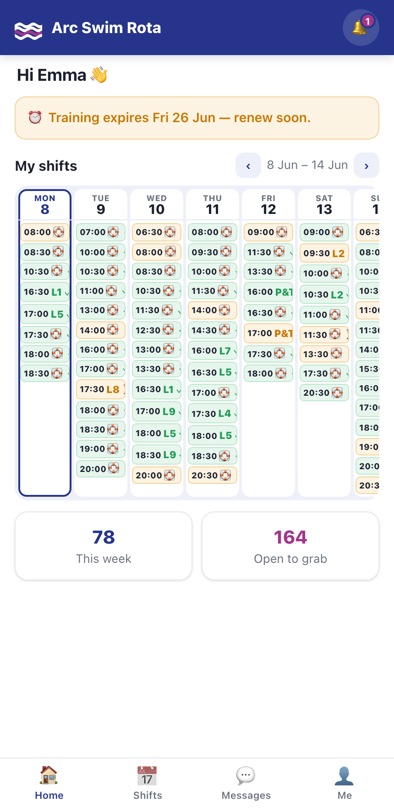
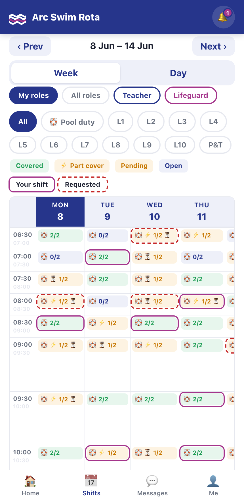
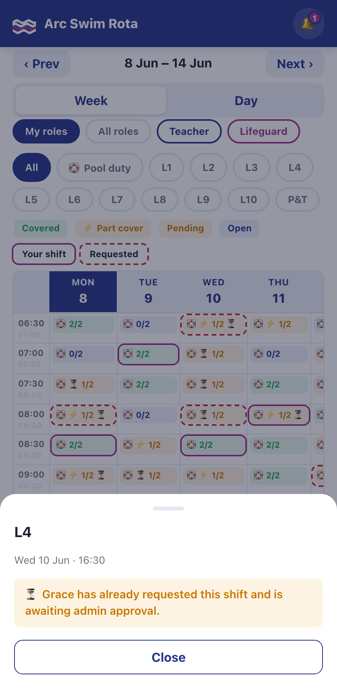
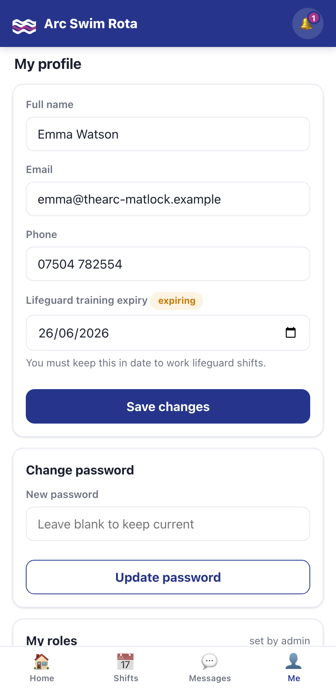
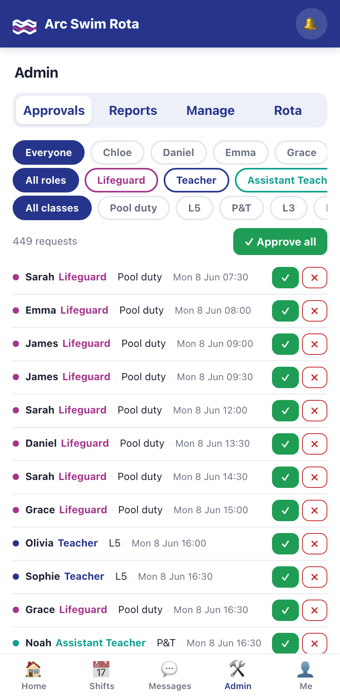
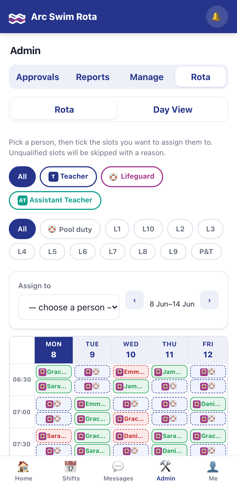
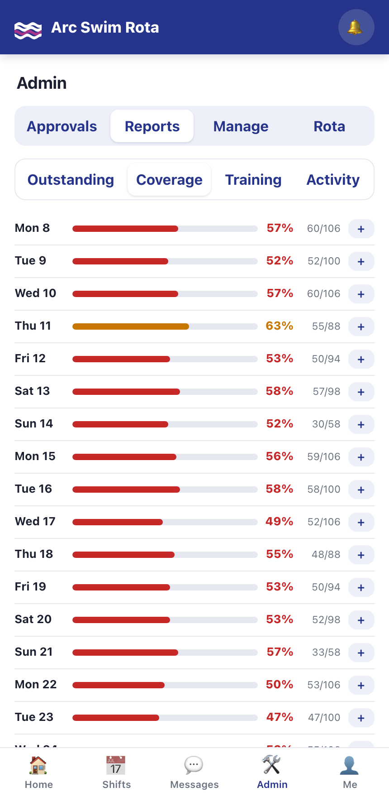
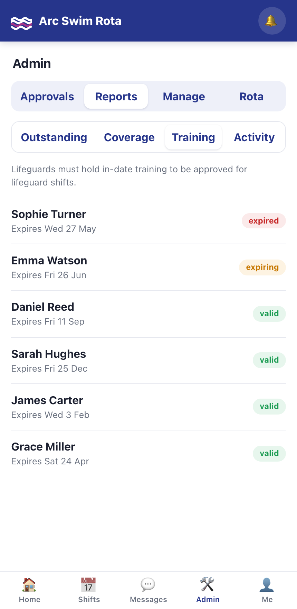

# Building a Swim-Club Rota App in Four Days with Claude Code

*How I went from a blank folder to a deployed, installable staff-scheduling app for a leisure-centre pool — pair-programming the whole thing with Claude Code.*

---

Every leisure centre runs on a rota, and almost every rota runs on a tired spreadsheet and a long email chain. The pool at **The Arc, Matlock** is no different: swim teachers and lifeguards need to be slotted into half-hour poolside sessions, lifeguards must hold in-date training, and somebody has to approve it all and chase the gaps.

I wanted to see how far I could get building a proper replacement — not a prototype, a *deployable* app — using **Claude Code** as my pair programmer. Four days and 46 commits later, **Arc Swim Rota** is a mobile-first Progressive Web App that staff can install on their phones, request shifts from, message each other in, and that admins can run the whole rota from.

This post is the story of how it came together, what the day-to-day workflow with Claude Code actually felt like, and an honest look at where it landed.

---

## The brief

The requirements were unglamorous and very real:

- **Two kinds of staff** — teachers and lifeguards (and assistant teachers) — with different qualifications.
- **Half-hour shifts** across a pool that's open from early morning to late evening, with **constant lifeguard cover** and **different swimming classes** running on different evenings.
- **Self-service**: staff request the slots they want; an admin approves.
- **Training rules**: a lifeguard whose qualification has expired must be **blocked** from lifeguard shifts.
- **It has to live on a phone.** Poolside staff aren't going to log into a desktop portal.

That last point pushed the whole design towards a **mobile-first PWA**: installable to a home screen, works offline, feels like an app.

---

## The stack — deliberately boring

I asked Claude Code to keep the technology minimal, and it held that line throughout:

- **Backend:** FastAPI + **SQLite**, with authentication written against the Python standard library only (PBKDF2 password hashing, HMAC-signed tokens).
- **Frontend:** **vanilla JavaScript** — a single-page app with **no build step, no bundler, no framework**.
- **Delivery:** Docker + **Caddy** (which gives you automatic HTTPS via Let's Encrypt), deployable to a **$6/month DigitalOcean droplet** with one command.

The entire app is around 5,300 lines. There's no `node_modules`, no webpack config, nothing to `npm install`. You can read it end to end in an afternoon — which, for a tool that one person is going to maintain, is exactly the point. Claude Code is very good at resisting the urge to reach for a framework when plain code will do, *if you tell it to*.

---

## What the workflow actually felt like

A few things made the four days productive rather than chaotic:

**A `CLAUDE.md` that acts as the project's memory.** Early on I had Claude Code write a project guide — how to run it locally, how to deploy, the data model, the frontend conventions, and the "gotchas." Every subsequent session started by reading that file, so I never had to re-explain the architecture. It even documents the one piece of necessary ceremony: *bump the service-worker cache version in three places after any static change*, or the PWA serves stale code to existing users.

**Tight, iterative loops.** Most commits are small and specific — "show inline clash warning in admin approvals," "part cover amber, Week tab first," "use dashed red outline for requested shifts." I'd describe a behaviour or a visual tweak, Claude Code would make the change across the backend and the 2,700-line frontend in one pass, and I'd check it in the browser. The commit log reads like a conversation.

**Deploy as a habit.** The project is wired so that after a change it gets pushed and redeployed to the live droplet automatically. "Make a change, see it live" was a 30-second loop, which completely changes how willing you are to polish.

**Honest course-correction.** Plenty of commits are `fix:` and `revert:` — `fix: All tab white-on-white`, `revert ms-pending`. The model doesn't get everything right first time; the value is in how fast you can see the mistake and turn it around.

---

## The build, day by day

The 46 commits fall into four clear phases.

### Day 1 (4 June) — Scaffold

The first commit is the whole skeleton: the SQLite schema (roles, levels, users, templates, slots, notifications), stdlib auth, the slot-generation engine that materialises bookable half-hour shifts from recurring weekly templates, a realistic data seeder, and the PWA shell with icons and a service worker. By the end of day one there was a working login and a calendar.

### Day 2 (5 June) — Classes and conversation

Two big moves. First, a proper **class-schedule system**: instead of hard-coded pool lanes, each swimming level (Parents & Toddlers, Level 1–10) gets a configurable weekly schedule and **default staffing** (e.g. Parents & Toddlers = 1 teacher + 1 assistant). Second — and this was the day's surprise — a full **team-messaging system**: channels, direct messages to admins, per-channel unread badges, all delivered in real time over Server-Sent Events.

### Day 3 (6 June) — The admin side grows up

This is where it started to feel like a product. A compact **approvals** queue, the first **reports**, a **day view**, and a redesigned "My Shifts" presented as a tight week grid of status chips.

### Day 4 (8 June) — The polish marathon

More than half the commits land on a single day, and it shows. This is when the app went from "functional" to "polished":

- An **interactive week timetable** with live coverage counts and a colour language for every state — covered, part-covered, pending, open.
- A **rota builder**: pick a person, tick the slots you want across the grid, bulk-assign them in one go — with a detailed report of anything that got skipped and *why*.
- **Inline clash warnings** in approvals that disable the approve button when a request collides with a shift the person already holds.
- **Training-expiry enforcement**, **role shortcodes**, a category-filtered **activity log**, a **configurable timezone**, and a locked **"All Staff" channel** every employee is automatically part of.

A final cluster of refinements tidied the edges: sign-in errors got clearer (a wrong password used to masquerade as a misleading "session expired" message — now it just says the password's wrong), and the timetable learned to name whoever has already requested a contested slot, so two people don't unknowingly chase the same shift.

---

## A tour of where it landed

### The staff experience

When a teacher or lifeguard opens the app, they get a personal dashboard: this week's shifts as a glanceable grid, a count of what's coming up versus what's still open to grab, and — if relevant — a gentle nudge that their training is about to expire.

The heart of the app is the **shift timetable**. Every half-hour slot shows how well it's staffed (`2/2`, `1/2`, `0/2`), colour-coded from green (covered) through amber (part cover) to open. Staff can filter to just their own roles or browse everything, and tap any open slot to request it.

Self-service only works if people aren't tripping over each other, so the timetable is honest about contention: tap a slot that someone has already requested (but that an admin hasn't approved yet) and it tells you exactly who's waiting on it. It's a small touch that stops two staff quietly chasing the same shift.

Their profile is where the training rule lives: record your lifeguard qualification's expiry date, and the system takes it from there.

### The admin experience

Admins get a four-tab control centre. **Approvals** is the daily workhorse — every request in one list, one-tap approve or decline (with an optional reason that gets messaged straight to the person), filters by individual, role, or class, and an "approve all" for quiet days.

The **rota builder** is the power tool: choose a member of staff, tick the slots you want them on across the whole week, and assign in bulk. Anything that can't be assigned — already taken, person not qualified, a time clash — comes back in a clear skip report rather than failing silently.

**Reports** turn the data into decisions: a daily **coverage percentage** so you can see at a glance which days are under-staffed…

…and a **training-status** view that flags every lifeguard as valid, expiring, or expired — the same rule that blocks expired lifeguards from being approved for cover.

---

## Where Claude Code shone — and where I had to steer

**It shone at breadth.** A single instruction like "show a pending count on the duty pills and let staff request an open slot from the names sheet" touched the data layer, an API endpoint, and several frontend render functions at once — and came back coherent. Holding a 2,700-line vanilla-JS SPA *and* a FastAPI backend in view simultaneously is exactly the kind of context-juggling that's tedious for a human and natural for the model.

**It shone at the unglamorous 80%.** Docker, the Caddy config, the deploy script, the database seeder, the service worker, the README and deploy docs — all the scaffolding that makes something *deployable* rather than just *runnable* got written without fuss.

**I had to steer on judgement calls.** The visual language of the timetable took several rounds — what colour means "part cover," whether requested shifts get a solid or dashed outline, which tab should come first. These are taste decisions, and the right move was lots of small iterations rather than one big spec.

**And it needs a critical eye on the hard parts.** I had the app audited afterwards, and the most important finding was a classic concurrency bug: two staff requesting the *same* open slot at the *same* instant could both be told they'd got it. It's the kind of race that never shows up in casual testing and becomes likely exactly when the app is busiest — the rota opening and everyone piling in. The fix turned out to be small — a status-guarded database update wrapped in an "immediate" transaction so simultaneous claims serialise, plus a test that fires six parallel requests at one slot to prove exactly one wins — but it's a reminder that "it works when I click it" and "it's correct under concurrent load" are different bars, and the model won't reach the second one unless you ask it to.

---

## So — is it production-ready?

For its actual job — one pool, a few dozen staff, a handful online at once — it's **deployed and close**. The architecture is clean, the security fundamentals (hashed passwords, parameterised queries, escaped output, gitignored secrets) are in place, and the feature set is genuinely complete.

The honest gap is a short, specific list — and the headline item is already closed. The shift-booking race conditions (so the "who has this shift" promise holds under load) are now fixed and covered by a concurrency test. That leaves a handful of smaller hardening jobs: force the default admin password to be changed, add login rate-limiting, and make the server's date logic timezone-aware. Roughly an afternoon of work, and it's the difference between an impressive demo and something staff can trust.

SQLite and a single server are the right call here, not a compromise — and there's a clear path (a shared message broker, Postgres) if it ever needs to grow beyond one pool. But that's a *next product* problem, not today's.

---

## The takeaway

Four days, 46 commits, one collaborator that never got tired of a "actually, can we make the amber slightly less aggressive" request. Claude Code didn't just autocomplete functions — it scaffolded the project, carried the architecture in its head across dozens of sessions, wrote the deploy pipeline, and turned a vague brief into something a leisure centre could genuinely run on.

The lesson I'm taking away isn't "AI writes the code for you." It's that the bottleneck moves. With the typing and the boilerplate and the context-switching largely handled, what's left is the stuff that was always the actual job: deciding what to build, having the taste to know when it's right, and the discipline to ask "but is it correct when fifty people use it at once?"

That, it turns out, is a pretty good division of labour.

---

*Arc Swim Rota is built with FastAPI, SQLite and vanilla JavaScript, and deploys to a single DigitalOcean droplet behind Caddy. The whole thing — including this write-up — was developed with Claude Code.*
